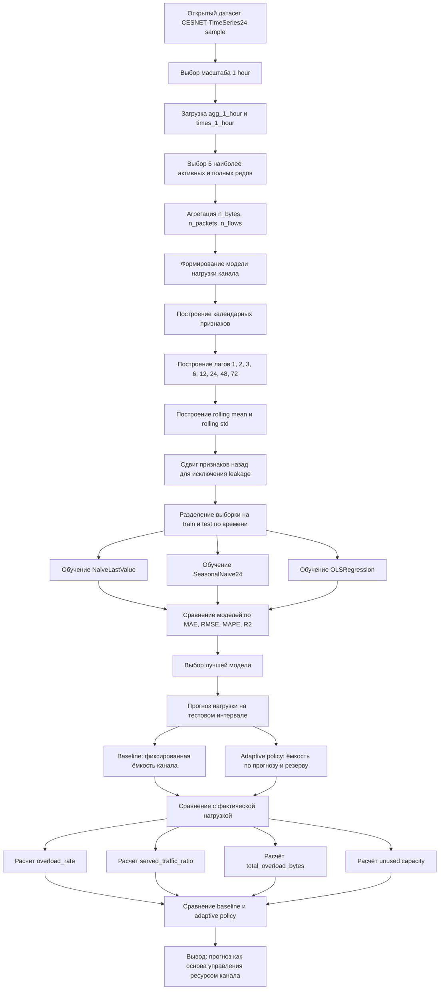
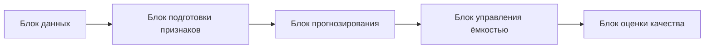
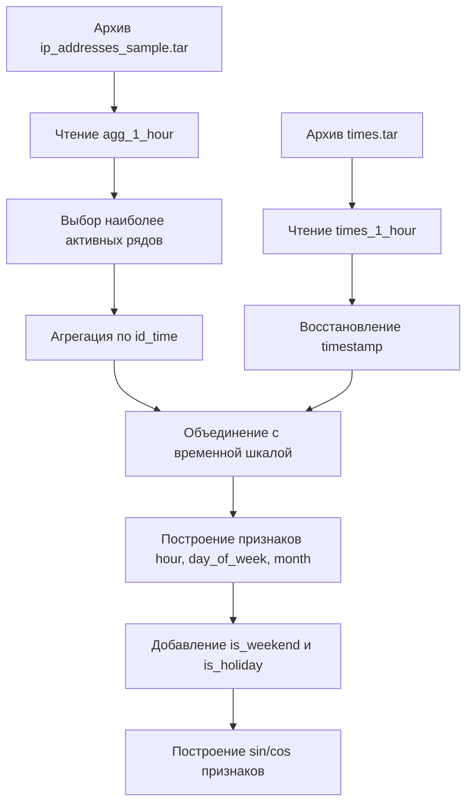
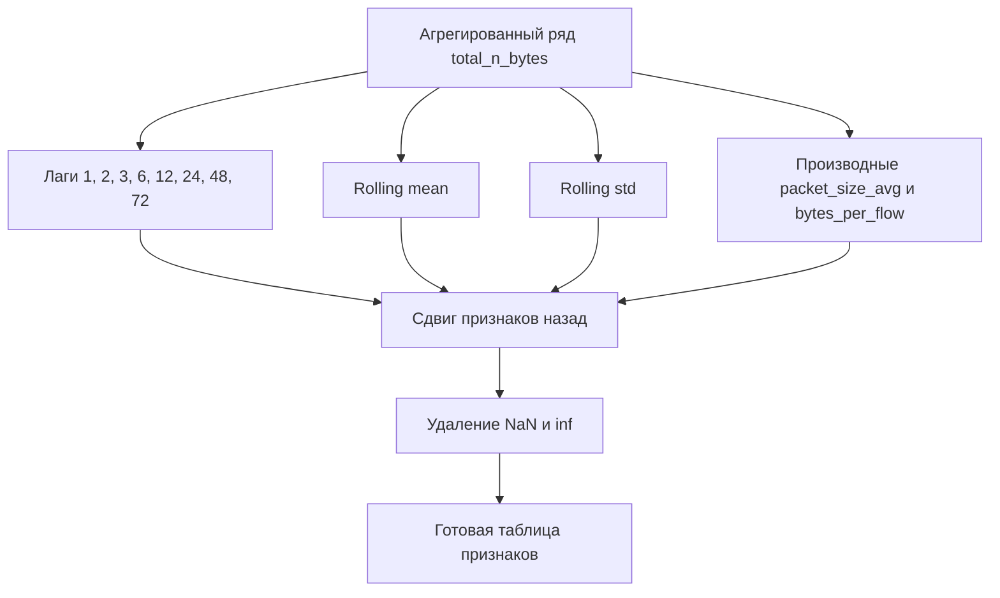
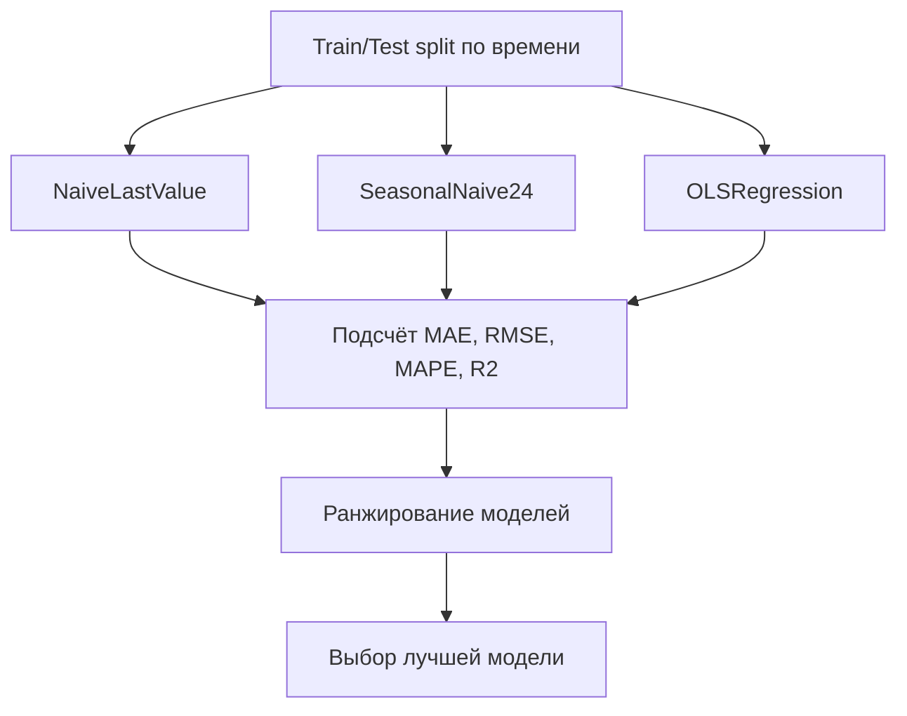
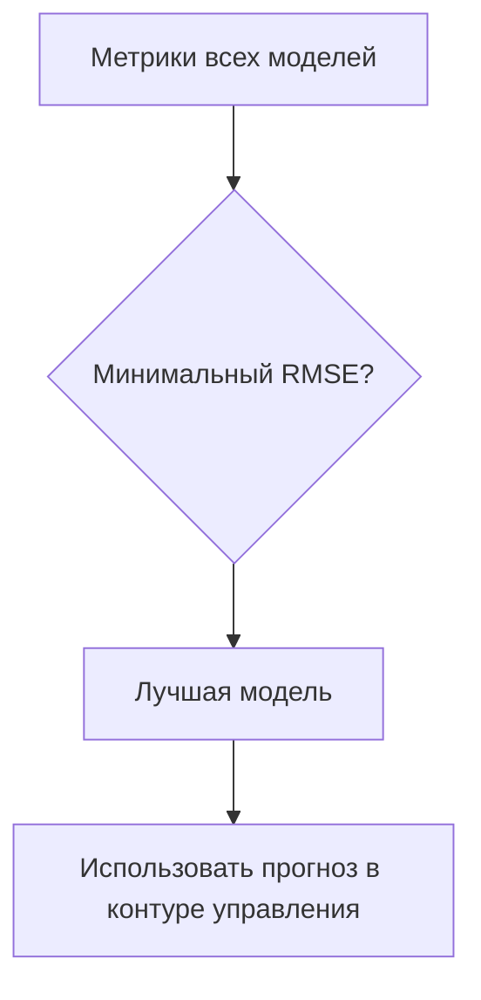

# Mermaid Schemes

Этот файл содержит полный набор `mermaid`-схем для проекта. Его удобно использовать как:

- единое место для просмотра всех алгоритмов;
- источник схем для презентации;
- материал для печати или вставки в отчёт.

## 1. Большая сквозная схема проекта

## 2. Архитектура системы верхнего уровня

## 3. Детальная схема подготовки данных

## 4. Детальная схема feature engineering

## 5. Схема прогнозного блока

## 6. Схема logic выбора лучшей модели

